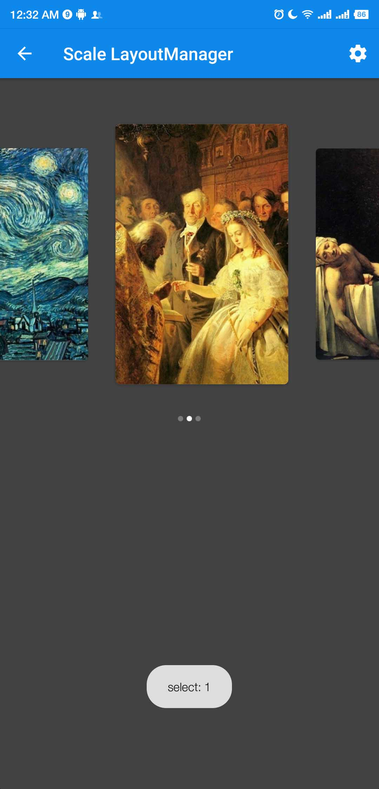
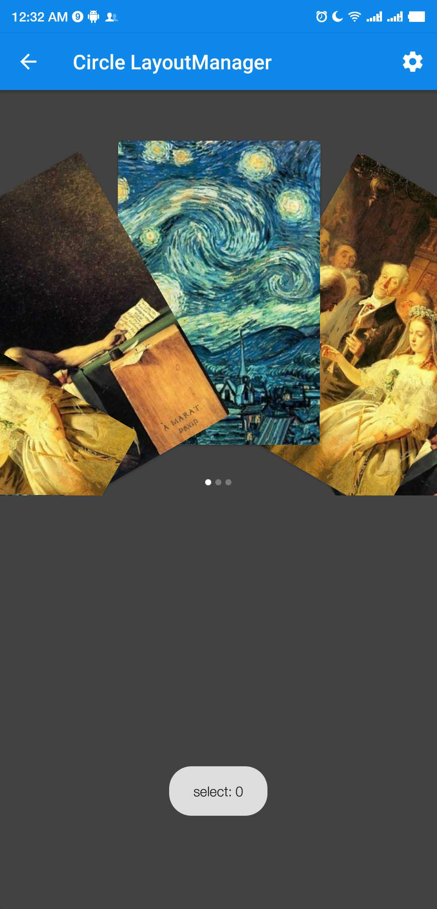
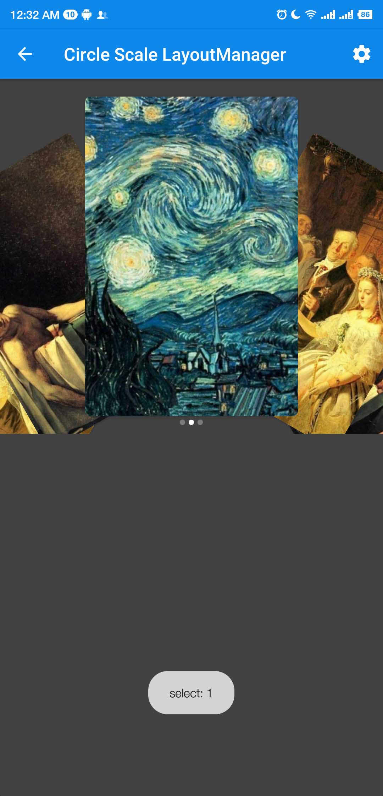
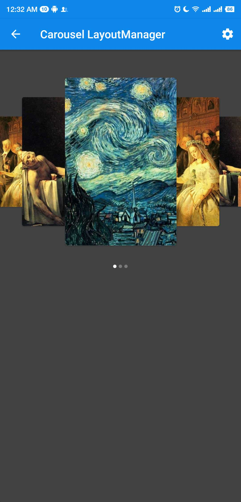
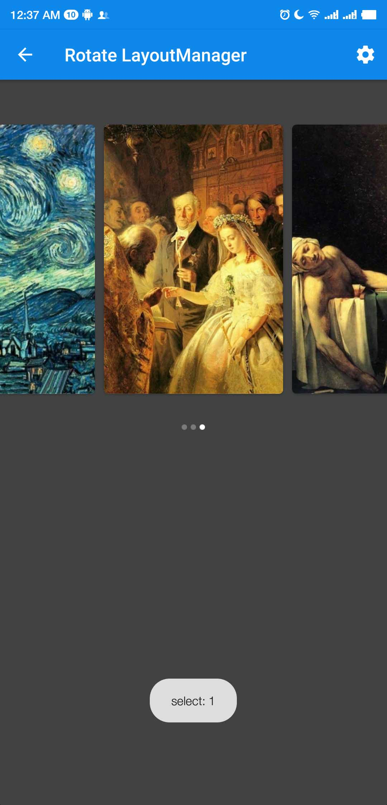
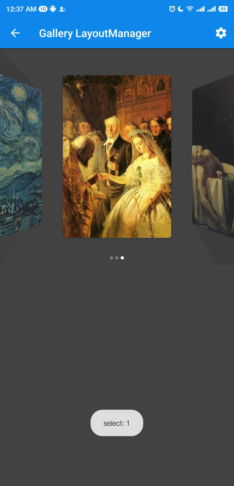

# Banner
[  ](https://bintray.com/leaflc/Maven/banner/beta1.1/link)

通用的广告栏控件，让你轻松实现广告头效果。

基于[ViewPagerLayoutManager](https://github.com/leochuan/ViewPagerLayoutManager "ViewPagerLayoutManager")库扩展而来，参考了[Android-ConvenientBanner](https://github.com/saiwu-bigkoo/Android-ConvenientBanner "Android-ConvenientBanner")

## Demo
实际效果<br>







## Download
Maven:
```
<dependency>
	<groupId>com.leaflc.banner</groupId>
	<artifactId>banner</artifactId>
	<version>beta1.0</version>
	<type>pom</type>
</dependency>
```
gradle
```
implementation 'com.leaflc.banner:banner:beta1.1'
```

### QuickStart
```
  //本地图片例子
        ViewPagerLayoutManager viewPagerLayoutManager =  new RotateLayoutManager(this, Util.Dp2px(this, 10));
        (banner as Banner<Int>).setPages(
            object : CBViewHolderCreator<Int> {
                override fun createHolder(itemView: View): Holder<Int> {
                    return LocalImageHolderView(itemView)
                }

                override fun getLayoutId(): Int {
                    return R.layout.item_image
                }

            }, localImages
        ).setOnItemClickListener(object : OnItemClickListener {
            override fun onItemClick(position: Int) {
                Toast.makeText(this@BaseActivity, "点击了第" + position + "个", Toast.LENGTH_SHORT)
                    .show()
            }
        }).setLayoutManager(viewPagerLayoutManager)
            .setPageIndicator(
                intArrayOf(
                    R.drawable.ic_page_indicator,
                    R.drawable.ic_page_indicator_focused
                )
            ).onPageChangeListener = object : ViewPagerLayoutManager.OnPageChangeListener {
            override fun onPageScrollStateChanged(state: Int) {
            }

            override fun onPageSelected(index: Int) {
                Toast.makeText(this@BaseActivity, "select: $index", Toast.LENGTH_SHORT)
                    .show()
            }
        }
```

## Thanks

* [ViewPagerLayoutManager](https://github.com/leochuan/ViewPagerLayoutManager "ViewPagerLayoutManager")
* [Android-ConvenientBanner](https://github.com/saiwu-bigkoo/Android-ConvenientBanner "Android-ConvenientBanner")
